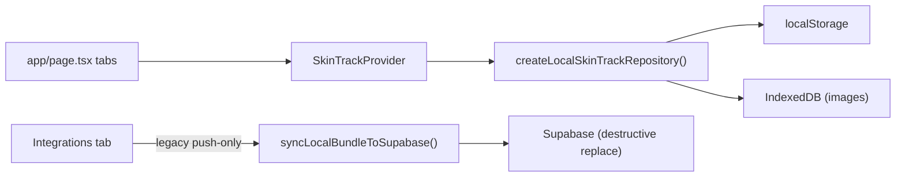

# Skeleton to End-to-End Integration

## Current architecture (what data flows through today)

Everything reads/writes through `SkinTrackProvider` which uses the local repo. The API routes, auth context, sync engine, and security layers exist as files but are not called by anything.

## Target architecture (after integration)

```mermaid
flowchart TD
  UI["app/page.tsx"] --> AuthGuard["Auth-aware shell"]
  AuthGuard --> Provider["SkinTrackProvider"]
  Provider --> LocalRepo["Local Repository"]
  LocalRepo --> LS["localStorage + IndexedDB"]
  Provider -->|"on write"| SyncQueue["lib/sync/queue.ts (IndexedDB)"]
  SyncQueue --> SyncEngine["lib/sync/engine.ts"]
  SyncEngine --> SyncAPI["POST /api/sync"]
  SyncAPI --> SupabaseDB["Supabase Postgres"]
  AuthGuard --> AuthCtx["context/AuthContext.tsx"]
  AuthCtx --> Login["app/login/page.tsx"]
  AuthCtx --> Middleware["middleware.ts"]
  Middleware --> SupabaseAuth["Supabase Auth"]
```

---

## Phase A: Deploy schema to Supabase

The SQL has never been executed against the live project. Two options:

- **Option 1 (recommended):** Copy `supabase/schema.sql` into the Supabase dashboard SQL editor and run it. This creates all tables, RLS, triggers, indexes, storage bucket, and policies in one shot.
- **Option 2:** Use Supabase CLI (`supabase db push`) -- but there's no `config.toml` in the repo, so CLI would need to be initialized first.

After applying, verify in the dashboard: 4 tables visible, RLS enabled, `skintrack-images` bucket exists under Storage.

Also in the Supabase dashboard:

- **Authentication > Providers:** Enable Email (magic link), enable PKCE
- **Authentication > URL Configuration:** Add `http://localhost:3000/auth/callback` and your production domain

---

## Phase B: Wire rate limiting + sanitization into API routes

The utilities exist but no route calls them. Add to [lib/api/helpers.ts](lib/api/helpers.ts):

- Import `checkRateLimit` and call it inside `getAuthenticatedClient()`, returning 429 if `!allowed`
- Export a `sanitizedBody()` helper that parses JSON + runs `sanitizeObject()` before Zod validation

Then update each API route to use `sanitizedBody()` instead of raw `request.json()`. This is a mechanical find-and-replace across ~8 route files.

---

## Phase C: Auth-aware UI shell

The app is a single page (`app/page.tsx`) with tab navigation. Integration means:

1. **In [app/page.tsx](app/page.tsx):** Import `useAuth` from `context/AuthContext.tsx`. Show a sign-in/sign-out button in the header area (next to the Install button). When signed out, the app works fully offline (local-first is preserved). When signed in, show user email + sign-out + sync status indicator.
2. **No forced redirects.** The app must work without auth (local-first is non-negotiable per CLAUDE.md rule #1). Auth is opt-in for cloud backup.
3. **In [features/integrations/integrations.tsx](features/integrations/integrations.tsx):** This component already has the legacy Supabase login + sync. Replace the legacy `syncLocalBundleToSupabase` call with the new sync engine flow. Keep the magic-link sign-in UI that already exists there, but switch it to use `useAuth()` state.

---

## Phase D: Wire sync engine into SkinTrackProvider

This is the core integration -- making local writes automatically queue for cloud sync.

1. **In [components/skintrack-provider.tsx](components/skintrack-provider.tsx):**
  - Import `useAuth` and `enqueue` from `lib/sync/queue.ts`
  - After every successful `saveRecord`, `upsertLesion`, `setProfile`, `replaceRecords`: if user is authenticated, call `enqueue()` with the appropriate table/action/payload
  - Import and call `useSyncEngine()` to start the 30s auto-sync interval
  - Expose `syncState`, `pendingCount`, `sync` (manual trigger) on the context value
2. **In [app/page.tsx](app/page.tsx):**
  - Show a small sync status indicator (e.g. cloud icon with pending count badge) in the header when authenticated

---

## Phase E: Update Integrations component

[features/integrations/integrations.tsx](features/integrations/integrations.tsx) currently has its own Supabase login and legacy sync logic inline. Refactor:

1. Remove the inline `getSupabaseBrowserClient()` auth calls -- use `useAuth()` instead
2. Replace `syncLocalBundleToSupabase()` with a "Sync now" button that calls the `sync()` function from the provider context
3. Show sync state (idle/syncing/synced/error/pending count) using the values now exposed from the provider
4. Keep export/import JSON functionality as-is (it's local-only and works)

---

## Phase F: Verify end-to-end flow

Manual testing checklist (no automated tests in this pass):

1. `npm run dev` -- app loads, local data works without auth
2. Click "Sign in" -- magic link sent, check email, click link
3. Redirected back to app with session -- user email visible, sync status shows
4. Create a skin event -- appears locally AND queued for sync
5. Wait 30s or click "Sync now" -- data appears in Supabase dashboard tables
6. Sign out -- app continues working offline
7. Upload an image -- stored in IndexedDB locally + uploaded to `skintrack-images` bucket on next sync

---

## Phase G: Update CLAUDE.md

Update section 2 (Current State Audit) to reflect:

- Auth is fully wired end-to-end
- Sync engine is integrated into the provider
- Rate limiting and sanitization are active on API routes
- Legacy `syncLocalBundleToSupabase` replaced in the Integrations UI
- Remaining risks (rate limiter in-memory, no automated tests, no pull-from-server yet)

---

## Files touched (summary)

- **Modified:** `components/skintrack-provider.tsx`, `app/page.tsx`, `app/providers.tsx`, `features/integrations/integrations.tsx`, `lib/api/helpers.ts`, ~8 API route files (sanitization), `CLAUDE.md`
- **Not modified:** All `lib/sync/`*, `lib/validators/`*, `lib/api/rate-limit.ts`, `lib/api/sanitize.ts`, `context/AuthContext.tsx`, `middleware.ts`, `app/login/page.tsx` -- these already exist and work as-is
- **Manual step (not code):** Apply `schema.sql` in Supabase dashboard + enable email auth + add callback URL

## What this does NOT cover (future work)

- Pull/restore from Supabase back to local (bidirectional sync)
- Automated tests
- Persistent rate limiting (Redis/edge)
- Dedicated API keys table (currently JSONB in profiles)
- Image thumbnail generation via Edge Function
- Production deployment (Vercel, domain, etc.)

